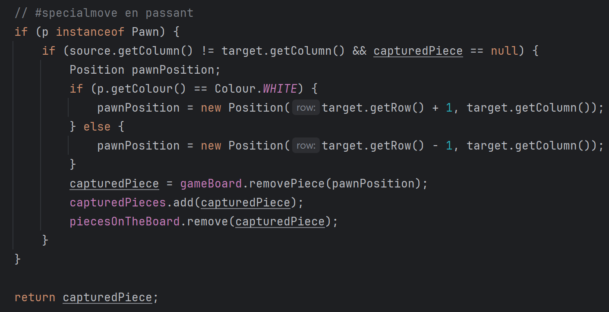

# Java-chess

## Singleton Pattern: 
This pattern is indeed used in the `ChessMatch` class, which ensures that only one instance of a chess match is active at any given time.

## Factory Pattern: 
The `ChessPiece` class uses this pattern to create instances of different subclasses (like `Rook`, `Bishop`, `Knight`, etc.) based on input parameters.

## Decorator Pattern:
The `ChessPiece` class introduces the Decorator Pattern to dynamically add functionalities to individual chess pieces. The `KnightDecorator` class serves as an example, adding the ability to move like a knight.

## Strategy Pattern: 
The `ChessMatch` class is utilizing the Strategy Pattern through the `ChessMove` interface which uses this pattern to define a family of algorithms for executing a move on the board. Each class that implements this interface (like `RegularMove`, `CastlingMove`, `EnPassantMove`, etc.) represents a different algorithm.

